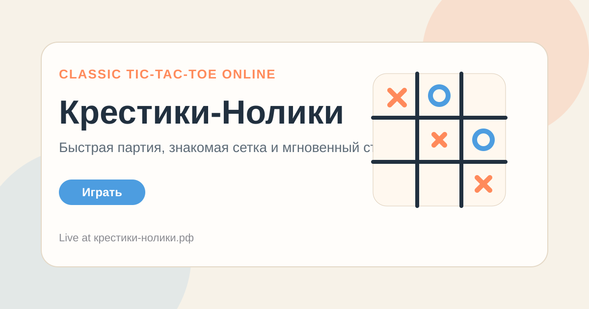

<h1 align="center">Крестики-Нолики</h1>

  Браузерная версия Tic-Tac-Toe с мгновенным стартом, знакомыми правилами и быстрыми партиями на любом устройстве.

  <a href="https://крестики-нолики.рф/"><strong>Играть</strong></a>
  ·
  <a href="https://github.com/ivanlukichev/---"><strong>GitHub Repo</strong></a>
  ·
  <a href="https://github.com/ivanlukichev"><strong>Другие проекты</strong></a>

  

## Что Это

«Крестики-Нолики» превращает классическую игру Tic-Tac-Toe в простой веб-продукт, который открывается и работает сразу. Здесь нет установки, сложных режимов входа или длинного онбординга: только знакомая сетка и быстрая партия.

Публичный репозиторий нужен как витрина проекта на GitHub, чтобы сайт было легче показать, связать с другими игровыми проектами и быстро объяснить в одном месте.

## Почему Работает

- Игру знает почти каждый, поэтому вход в продукт мгновенный.
- Формат подходит для коротких сессий и мобильного экрана.
- Простая механика хорошо выглядит в статической веб-подаче.
- README теперь работает как аккуратная landing-страница репозитория.

## Кратко О Проекте

- Жанр: классическая настольная игра
- Язык: русский
- Формат: браузерная версия Tic-Tac-Toe
- Стек: статический фронтенд
- Цель: быстрый и понятный casual play

## More Projects

| Project | Live site | Public repo |
| --- | --- | --- |
| Solitaire | [играть-пасьянс.рф](https://играть-пасьянс.рф/) | [-](https://github.com/ivanlukichev/-) |
| PlayBlockGame | [playblockgame.ru](https://playblockgame.ru/) | [PlayBlockGame](https://github.com/ivanlukichev/PlayBlockGame) |
| BlockPlay | [blockplaygame.com](https://blockplaygame.com/) | [BlockPlay-Game](https://github.com/ivanlukichev/BlockPlay-Game) |
| Goroda | [goroda-na.ru](https://goroda-na.ru/) | [Goroda-na](https://github.com/ivanlukichev/Goroda-na) |
| Slova Game | [slova-game.ru](https://slova-game.ru/) | [SlovaGame](https://github.com/ivanlukichev/SlovaGame) |
| Sudoku Play | [sudoku-play.org](https://sudoku-play.org/) | [Sudoku-Play](https://github.com/ivanlukichev/Sudoku-Play) |
| PickWinner | [pickwinner.tools](https://pickwinner.tools/) | [pickwinner](https://github.com/ivanlukichev/pickwinner) |
| HTTPTools | [httptools.net](https://httptools.net/) | [HTTPTools](https://github.com/ivanlukichev/HTTPTools) |

## Играть

  <a href="https://крестики-нолики.рф/"><strong>Открыть Крестики-Нолики</strong></a> 
  Классическая игра в браузере для быстрых партий без установки.

